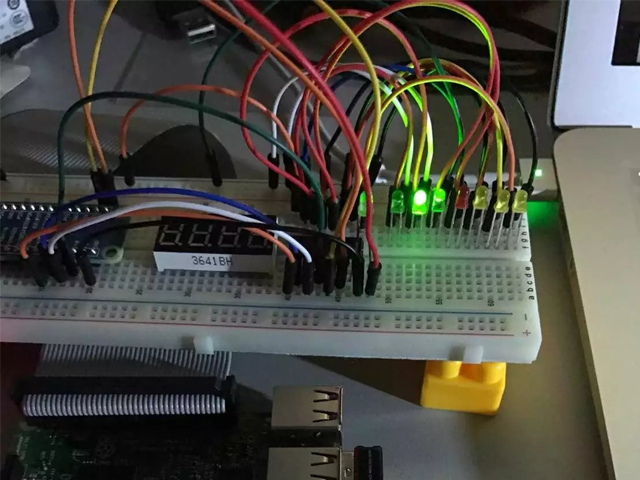

python的库简直就是一个宝库，想用的工具都能找到，这里要读midi文件直接引用midi库就ok了。

自己写一个led的GPIO驱动就可以了，问题是三阶的曲子要21个灯，算上半高音符需要的就更多了，树莓派的gpio没有那么多，需要编码和解码。

midi库已经能将音符解析出来编码用程序就能实现，解码级联了三片三八译码器，应付普通的儿歌完全没有问题。

## Quick Start
view code: [github](https://github.com/bblu/raspberrypi/tree/master/midi)
