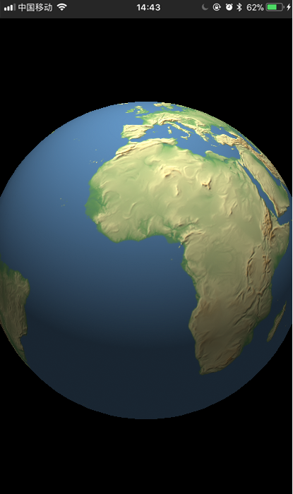

> coursera IOS 开发入门和给孩子开发的小程序

## calculator
按照Coursera入门教程一点一点敲的代码，很适合熟悉xcode的环境。

## earth
使用senceKit给孩子做的一个地球仪，画了一个球贴了一张图。

## myday
用了许多时间管理软件都不太适合，要给自己做一个每日计划和时间管理的app。
flag：还是要做的。

## person
swift类的小测试

view code: [github](https://github.com/bblu/ios/)
