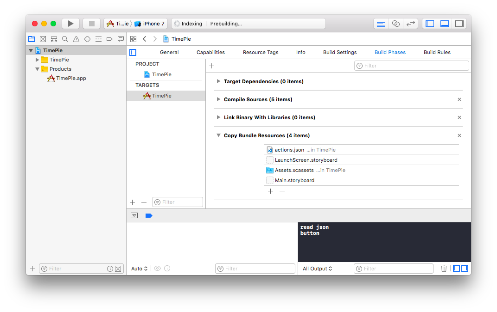
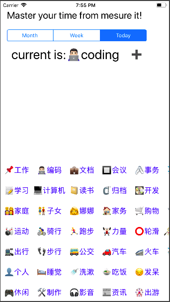

> 被锤子打击之后就没怎么去写日程了，除了失望另一个很重要的原因是直接在Google日历上无论是添加计划还是修改计划都太麻烦，为自己又不是能完全按照时间计划去执行的人，也没有那么多时间去搞了。那就换手机了，在苹果应用市场上搜集了十几款时间日程管理的软件发现都不是我想要的，于是就想自己开发一个这就是我开发这个软件的原因。

最早起名叫Myday感觉太土了这次重新做改名叫TimePie，github单独起了一个【[TimePie](https://github.com/bblu/timepie)】。


## 各种白痴问题
### 1.添加按钮事件
这个以前都是有鼠标的，这次出差没带鼠标单击了半天就是不能把按钮关联到事件创建上，一晚上也无解直到第二天才恍然大悟应该是右击。

### 2.添加资源文件
资源文件的结构要和解码的结构对应
``` base
{
    "user":"bblu",
    "date":"2018-03-09",
    "items":[
             {"name": "work","alias":"工作","icon":"📌","code":0,"span":360},
             {"name": "coding","alias":"编码","icon":"👨🏻‍💻","code":1,"span":60}
    ]
}
```

写好json的配置文件放到对应目录下,找的代码这么也读不出来，反复看视频和查资料发现是自己白痴了！
解决方法：打开build Phases中的 copy Bundle Resources点击下面的+把你需求的文件添加进去，然后再运行就可以获取到你的文件路径了。



### 3.swift 4新增的codable方式定义自己的数据模式
``` bash
struct TodoConfig:Decodable{
    let user:String
    let date:String
    let items:[TodoItem]
}

struct TodoItem: Decodable{
    let name:String
    let alias:String
    let icon:String
    let code:Int
    var span:Int
}

``` 
### 4.通过代码初始化按钮

``` bash
    func addButtons(items:[TodoItem]){
        for item in items{
            let pos = item.code
            //pos:   0,  1,  2,  3,  4
            //     100,101,102,103,104
            let px = (pos % 10) * 80
            let py = 400 + (pos / 10) * 50
            let btnItem = UIButton(frame: CGRect(x:px, y: py, width: 80, height: 30))
            //btnItem.addTarget(self, action: Selector("clickItem"), 
            for: UIControlEvents.touchUpInside)
            btnItem.translatesAutoresizingMaskIntoConstraints = false
            btnItem.setTitle(item.alias, for: UIControlState.normal)
            btnItem.setTitleColor(UIColor.blue, for: UIControlState.normal)
            //btnItem.backgroundColor = UIColor.lightGray
            // btnItem.addTarget(self, action: Selector("clickItem"), 
            for: UIControlEvents.touchUpInside)
            self.view.addSubview(btnItem)
        }
    }
``` 
