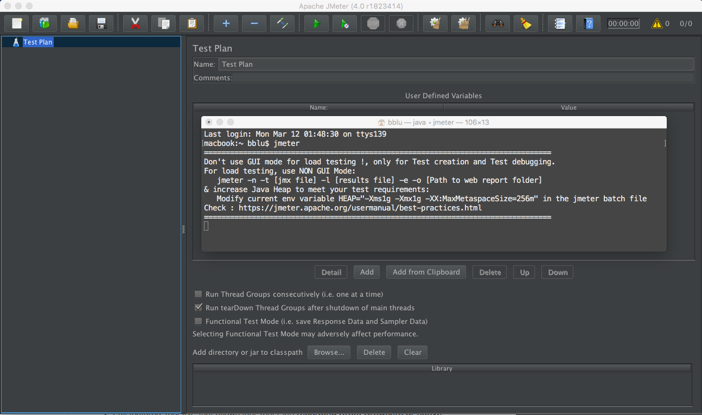
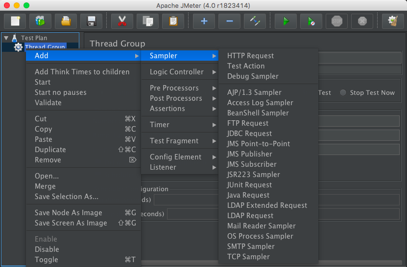

>  Apache JMeter 一个测试web功能和性能的开源Java软件，对java框架和协议支持良好，基本上应用协议都能测试。

先上图安装完后长这个样子，大体看了这货一下我的感想是这个东西是纯程序员思维的产品，肯定没有和测试商量去问他们的需求就开发出来的东西，这种产品会越来越多的。

- Web - HTTP, HTTPS (Java, NodeJS, PHP, ASP.NET, …)
- SOAP / REST Webservices
- FTP
- Database via JDBC
- LDAP
- Message-oriented middleware (MOM) via JMS
- Mail - SMTP(S), POP3(S) and IMAP(S)
- Native commands or shell scripts
- TCP
- Java Objects

支持浏览器或程序界面录制测试用例或者命令行模式工作，生成动态页面报告。

## TestPlan的节点
JMeter的TestPlan对应的应该是TestSuit，它下面节点的介绍，注意的是这些不同类型的节点可以互相嵌套的。

- Thread group： the beginning points of any test plan. 
- Controller：控制器节点可以组合嵌套实现流程控制像程序语言到控制语句
- Samplers:功能和它名字一样触发服务测试
- LogicControllers:逻辑控制比如对应登录操作只执行一遍
- TestFraments：当前TreadGroup的别名供其他group引用做到复用的特殊控制节点

