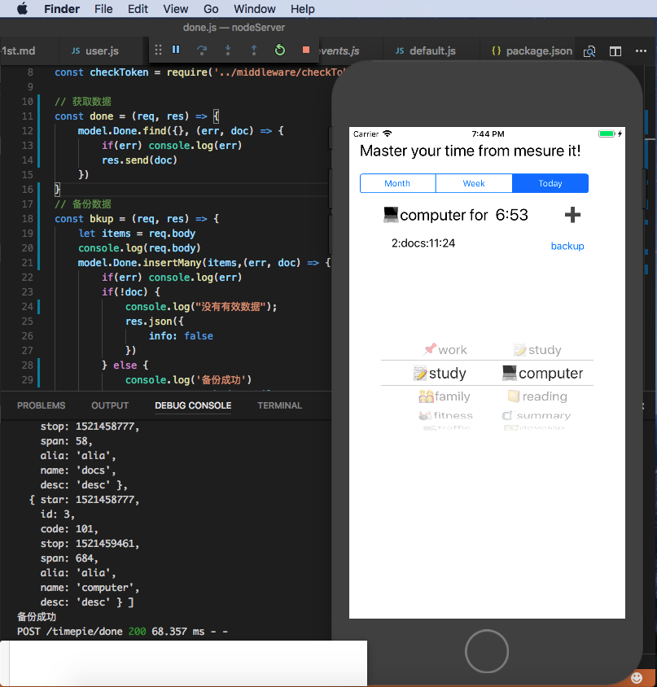
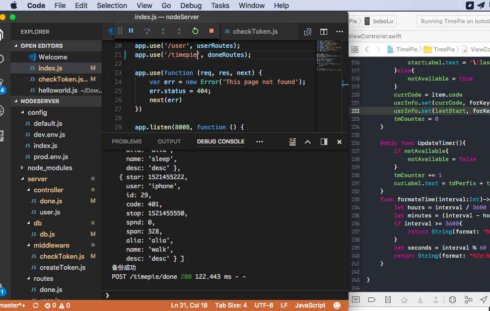

>  一个程序最有价值的就是数据了，todo是一个高度结构化的数据放到sqlite是最合适不过的了，存到本地的数据库中还是远远不够的如果手机丢了就废了。

json数据最好的归宿就是mongodb，用mongodb支持最好的就是JavaScript了，所以后台用Express+mongoose+mongodb。至此这个app的核心功能根据配置初始化界面，数据本地存储和网络备份和恢复就完成了，五天时间这个app至少处于可用状态了后面就是按需优化，然后是计划编排然后是统计分析，完成率分成两种一种是根据时间长度的比如每天读书1个小时，严格的检验是晚上9点-10点读书一个小时，这样激励自己不断的向计划靠拢。定一个目标完成后然后给予自己一定的奖励，比如奖励自己一个QC35。

### 1.对象编码 JSONEncoder
使用JSONEncoder的化开发者要做的工作就是把自己的完事项继承自Encodaable就可以了  

``` bash
#代码示例
struct DoneList: Encodable{
    let items:[DoneItem]
}
struct DoneItem: Encodable{
    let id:Int
    let code:Int      // 3digits support for two steps of actions
    ...
    let desc:String
}
#从数据初始化
let d = DoneItem(id:id, code:code, star:start, stop:stop,span:span, name:name, alia:"alia", desc: "desc")
doneList.append(d)

#两行代码完成需要的编码
let encoder = JSONEncoder()
let json = try encoder.encode(doneList)

```

### 2.网络发送 URLRequest  

```bash
#模拟器调试的话endpointUrl可以取本地地址
var request = URLRequest(url: endpointUrl)
request.httpMethod = "POST"
request.httpBody = json
request.addValue("application/json", forHTTPHeaderField: "Content-Type")
request.addValue("application/json", forHTTPHeaderField: "Accept")
let task = URLSession.shared.dataTask(with: request)
task.resume()

```

### 3.服务端接收



ServerCode:【[nodeServer](https://github.com/bblu/timepie/tree/master/nodeServer)】

> 讲真在点击手机backup按钮数据突突的上数据的那一刻还是挺兴奋的

