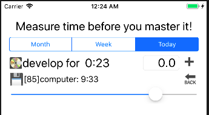
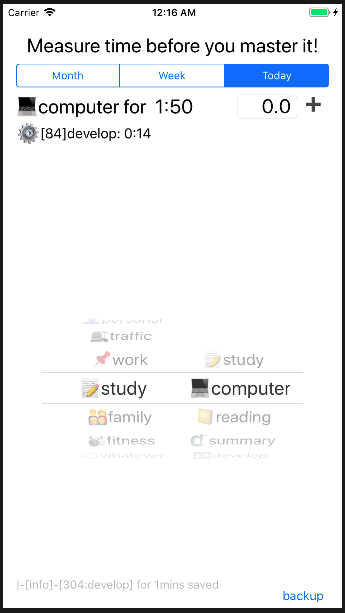

>  很久没这么连续加班到后半夜的了，真有点吃不消。之前程序计时器后台会停摆唤醒后时间会落后，后台切换到前台需要刷新显示。另外因为目前按照计划自动日程的功能还没实现，加了一个调整上次记录功能是在忘记记录的时候使用的。

### 1.再次唤醒程序刷新页面
```swift
override func viewDidLoad() {
    super.viewDidLoad()
    NotificationCenter.default.addObserver(self, selector: #selector(applicationDidBecomeActive(_:)),
                                            name: NSNotification.Name.UIApplicationDidBecomeActive,
                                            object: nil)
    //...
}

override func viewWillDisappear(_ animated: Bool) {
    super.viewWillDisappear(animated)
    NotificationCenter.default.removeObserver(self,
        name:NSNotification.Name.UIApplicationDidBecomeActive,object: nil)
    //print("removeObserver")
}

```

### 2.记录调整主要看界面
代码就是普通逻辑没什么可看的，点击️【⚙️ 】按钮显示一个返回按钮🔙  和拖动条



### 3.完善和Debug
- 加入了前台日志在最底下
- 修正选择延时的逻辑BUG：延时没有顺延更新变量。
- 封装了日志接口可以以后扩展输出

目前是这样的

