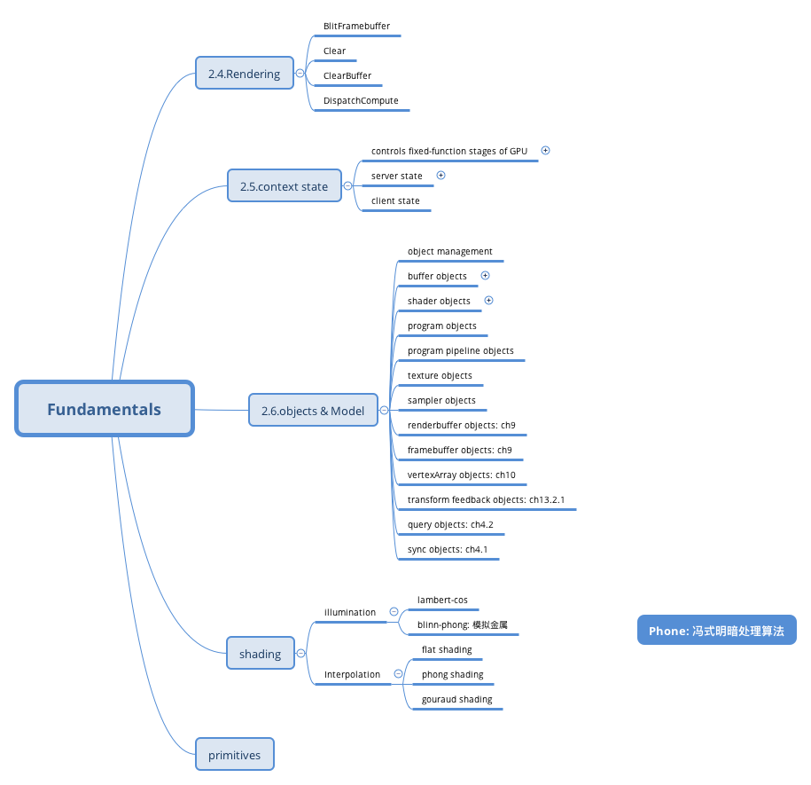
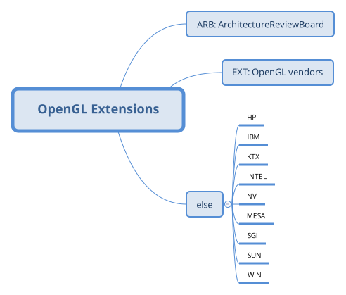

> 上篇说到在DOS时期，应用程序如果要对于显示设备做输出的话，必须使用INT 10中断，或对于VGA卡直接I/O，或直接对VRAM所在的记忆体位置作填值。但VGA卡当时日新月异，各家的VGA卡在其I/O ports的定义并不一致，虽中间有推出一个名为VESA SVGA的显卡驱动程序的共用标准，但由于DOS时先天的64KB的标签页限制，仍有许多不便。

图形库用来完成一些和绘制有关的工作，像直线或曲线的绘制，文字渲染，颜色控制等。比如微软的GDI、Macintosh的Quartz和GTK的GDK/Xlib等。比如要画一条线如果CPU亲自来的话，坐标系要自己管，线宽内在屏幕上的点要自己算自己填充，如果要抗锯齿还要自己去柔化边缘。微软在开发Windows时，发现这个问题，于是决定打造一个GDI子系统，将显示设备改以API的方式进行操作，以便将各VGA卡的差异通过各VGA卡厂商自行制作的驱动程序来衔接GDI，来打消各VGA卡在操作上的彼此差异。 

话说云风的那本《编程感悟》里对GDI也有所介绍，那本书挺适合入门的。微软在1995年发布Direct3D，Direct 3D最终成为OpenGL的主要竞争对手。现在应该QT的用户会更多一些,毕竟支持底层OpenGL加速，本来微软DirectX凭借系统的装机量和对游戏的支持已经把SGI的OpenGL打得没有还手之力了，结果移动领域的大爆发凭借OpenGL ES又强势逆转了。（注：2006年7月，OpenGL架构评审委员会投票决定将OpenGL API标准的控制权交给Khronos Group）

## 1.GDI【Graphics Device Interface】

图形设备接口是微软公司视窗操作系统的三大核心部件之一，图形设备包括但是不限于显示器、打印机之类输出设备的标准，也就是说只要这些图形设备驱动支持GDI这个标准就可以被使用GDI的应用程序使用。

GDI最大的好处是它有可以直接访问硬件设备的能力。通过GDI可以非常容易的在不同类型的设备上绘制图形，像显示屏和打印机或类似的显示设备。这些能力是微软Windows系统“所见即所得”程序的核心。但微软很快就被其他的程序开发者告知，GDI太慢了，因此Microsoft就再出一个WING用于Windows 3.0，让应用程序能够直接对VRAM进行填值，以加速绘图的相关计算。

后来，WING再改为DirectDraw成为DirectX的一部分，直到DirectX 7。（DirectX 8以后，DirectX中2D与3D显示技术合并，开始进入全3D的贴图计算方式）
直到DirectX 10时，已经进入以DirectX的COM为基础，以.Net Framework方式进行封装的XNA之时代。XNA身兼DirectX的性能与.Net Framework的使用便利性，目前被应用于XBOX系列的游戏主机上，现已成为新一代的图形子系统的主流。  

### GDI+
GDI+从Windows XP操作系统开始引入，提供二维的向量图形，改进旧有的GDI，加强的可视化属性，例如边界，渐变和透明。通过GDI+，能够直接将BMP转成JPG或其它格式的图片，还能够生成SVG、Flash等。GDI+ 使用ARGB的值来表示颜色。GDI+的双缓冲技术可以提高绘图效率，可避免屏幕闪烁。

GDI+号称提供了硬件加速功能，可以直接访问硬件。但这似乎是夸饰的说法，GDI+无法直接使用VGA卡上的GPU来加速绘图的相关计算，因此在绘图性能上远远不及DirectX，只能做到Lock内存进行操作。（GDI+只是一组重新封装GDI的API，DirectX则是从COM到底层的显卡驱动程序的组合）

随GDI+推出了加强型EMF，即EMF+，可以同时支持GDI和GDI+。Microsoft .NET通过System.Drawing命名空间提供对GDI+的支持。The GDI+ 的DLL可移植到旧有的Windows版本上。
GDI+ 类似Apple的Quartz 2D子系统，以及属于开放源代码（open-source）的libart和Cairo库。

> 从A语言到B语言再到C语言，然后C++ 貌似微软挺喜欢+的C#里就一下就整了四个！

## OpenGL
1980年代，开发可以用在各种各样图形硬件上的软件是个真正的挑战。(这么说80后都和CG同时代产生喽)通常，软件开发人员为每种硬件编写自定义的接口和驱动程序。但这非常昂贵并会导致大量工作的重复。90年代初，SGI成为工作站3D图形领域的领导者。其IRIS GL的API被认为是最先进的科技并成为事实上的行业标准，1992年，SGI公司领导了OpenGL架构审查委员会（OpenGL ARB）的创建。该委员会由若干公司组成，负责未来OpenGL规范的维护和扩充。

也就是说OpenGL早期是图形库后来就进化成一套接口规范了，向上为图形开发者提供服务，向下对接显卡厂商，接口的实现都是各大厂商去做了。虽然这些函数的定义表面上类似于C语言，但它们是语言独立的。因此，OpenGL有许多语言绑定，值得一提的包括：JavaScript绑定的WebGL(最新的WebGL 2.0规范基于OpenGL ES 3.0并于2017年1月完成)；C绑定的WGL、GLX和CGL；iOS提供的C绑定；Android提供的Java和C绑定。

OpenGL不仅语言无关，而且平台无关。规范只字未提获得和管理OpenGL上下文相关的内容，而是将这些作为细节交给底层的窗口系统。出于同样的原因，OpenGL纯粹专注于渲染，而不提供输入、音频以及窗口相关的API，这些事理所应当的被流放到三维引擎那一层了，通过场景树维护渲染对象，截获上层窗口和键盘事件向下转发，当然最主要的是把渲染线的接口封装成各种参数化图形的接口，把渲染三角形的接口封装成能加载模型的接口，把模型视图矩阵包装成场景操控器。

OpenGL规范描述了绘制2D和3D图形的抽象API。尽管这些API可以完全通过软件实现，但它是为大部分或者全部使用硬件加速而设计的。OpenGL的API定义了若干可被客户端程序调用的函数，以及一些具名整型常量（例如，常量GL_TEXTURE_2D对应的十进制整数为3553）。

OpenGL是一个不断进化的API。新版OpenGL规范会定期由Khronos Group发布，新版本通过扩展API来支持各种新功能。每个版本的细节由Khronos Group的成员一致决定，包括显卡厂商、操作系统设计人员以及类似Mozilla和谷歌的一般性技术公司。

除了核心API要求的功能之外，GPU供应商可以通过扩展的形式提供额外功能。扩展可能会引入新功能和新常量，并且可能放松或取消现有的OpenGL函数的限制。然后一个扩展就分成两部分发布：包含扩展函数原型的头文件和作为厂商的设备驱动。供应商使用扩展公开自定义的API而无需获得其他供应商或Khronos Group的支持，这大大增加了OpenGL的灵活性。OpenGL Registry负责所有扩展的收集和定义。
每个扩展都与一个简短的标识符关系，该标识符基于开发公司的名称。例如，英伟达（nVidia）的标识符是NV。如果多个供应商同意使用相同的API来实现相同的功能，那么就用EXT标志符。这种情况更进一步，Khronos Group的架构评审委员（Architecture Review Board，ARB）正式批准该扩展，那么这就被称为一个“标准扩展”，标识符使用ARB。第一个ARB扩展是GL_ARB_multitexture。
OpenGL每个新版本中引入的功能，特别是ARB和EXT类型的扩展，通常由数个被广泛实现的扩展功能组合而成。

