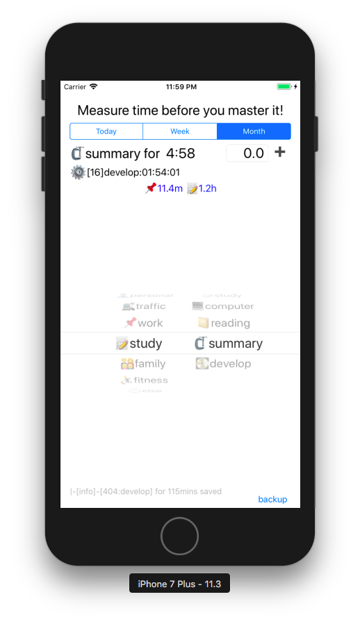

> 有了数据就可以统计一下每周或者每月平均时间开销了，工作有两部分一块是时间段控制（至于是自然月还是前30天看个人口味了，我是喜欢当前周和自然月有渐进的成就感）另一部分是数据库查询那个就比较简单了。

### 1.扩展Date计算时间段
```swift
extension Date {
    // returns an integer from 1 - 7, with 1 being monday and 7 being Sunday
    var dayOfWeek: Int {
        // returns an integer from 1 - 7, with 1 being Sunday and 7 being Saturday
        let dow = Calendar.current.dateComponents([.weekday], from: self).weekday!
        if dow == 1 {
            return 7
        }
        return dow - 1
    }
    var thisDay: Date {
        let base = Calendar.current.date(from: Calendar.current.dateComponents([.year, .month, .day], from: self))!
        let today = Calendar.current.date(byAdding: .hour, value: 8, to: base)!
        return today
    }
    
    var thisWeek: Date {
        let base = Calendar.current.date(from: Calendar.current.dateComponents([.yearForWeekOfYear, .weekOfYear], from: self))!
        let week = Calendar.current.date(byAdding: .hour, value: 32, to: base)!
        return week
    }
    var thisMonth: Date {
        let base = Calendar.current.date(from: Calendar.current.dateComponents([.year, .month], from: self))!
        let month = Calendar.current.date(byAdding: .hour, value: 8, to: base)!
        return month
    }
}
//选择时间段的操作
@IBAction func staticSpanChanged(_ sender: UISegmentedControl) {
        let index = sender.selectedSegmentIndex
        var begin = Date().thisDay
        let weekends = Date().dayOfWeek
        var ajust = 0
        var days = 1
        if index == 1{
            begin = Date().thisWeek
        } else if index == 2 {
            begin = Date().thisMonth
            ajust = -1
        }
        days = Calendar.current.dateComponents([.day], from:begin, to:Date()).day! + 1
        let weekdays = weekdaysByNow(dayofweek: weekends, days: days) + ajust
        print("days:\(days),weekdays:\(weekdays)")
        let sumMain = db.sumMainClassSince(begin:Int(begin.timeIntervalSince1970))
        var statistics = ""
        for (main,sum) in sumMain.enumerated(){
            if main > 0 && sum > 0 {
                if main == 1{
                    statistics += "🛏️\(shortTime(interval:Double(sum), days:Double(days))) "
                }else if main == 3{
                    statistics += "\(tdData[main*100]!.icon)\(shortTime(interval: Double(sum), days:Double(weekdays))) "
                }else{
                    statistics += "\(tdData[main*100]!.icon)\(shortTime(interval: Double(sum), days:Double(days))) "
                }
            }
        }
        statisticsLabel.text = statistics
    }
```

### 2.Sqlite数据库查询
```swift
//为了方便统计又加了一个主类字段
func alterTableDone()->String {
        if sqlite3_exec(db, "alter table Done add column main INTEGER", nil, nil, nil) == SQLITE_OK {
            sqlite3_exec(db, "CREATE INDEX index_main ON Done (main);", nil, nil, nil)
            sqlite3_exec(db, "CREATE INDEX index_code ON Done (code);", nil, nil, nil)
            
            if sqlite3_exec(db, "UPDATE Done SET main = code/100", nil, nil, nil) == SQLITE_OK {
                return "ok"
            }else{
                let errmsg = String(cString: sqlite3_errmsg(db)!)
                print("error update table: \(errmsg)")
                return errmsg
            }
        }
        return "none"
    }
    
// calculate the amount of main class timespan for a peried time
    func sumMainClassSince(begin:Int)->[Int] {
        var aSum = [0,0,0,0,0,0,0]
        let queryString = "SELECT main,SUM(span) sums FROM Done WHERE stop > \(begin) AND (code = 101 or main in (2,3,4,5,6)) GROUP BY main ORDER BY main"
        //statement pointer
        var stmt:OpaquePointer?
        //preparing the query
        if sqlite3_prepare(db, queryString, -1, &stmt, nil) != SQLITE_OK{
            let errmsg = String(cString: sqlite3_errmsg(db)!)
            print("\(errmsg)")
            return aSum
        }
        while(sqlite3_step(stmt) == SQLITE_ROW){
            let main = Int(sqlite3_column_int(stmt, 0))
            let sums = Int(sqlite3_column_int(stmt, 1))
            //print("m:\(main),s:\(sums)")
            aSum[main] = sums
        }
        return aSum
    }
```

### 3.离目标又进了一步
