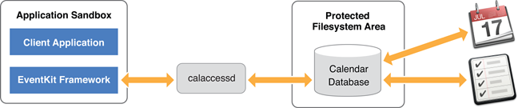
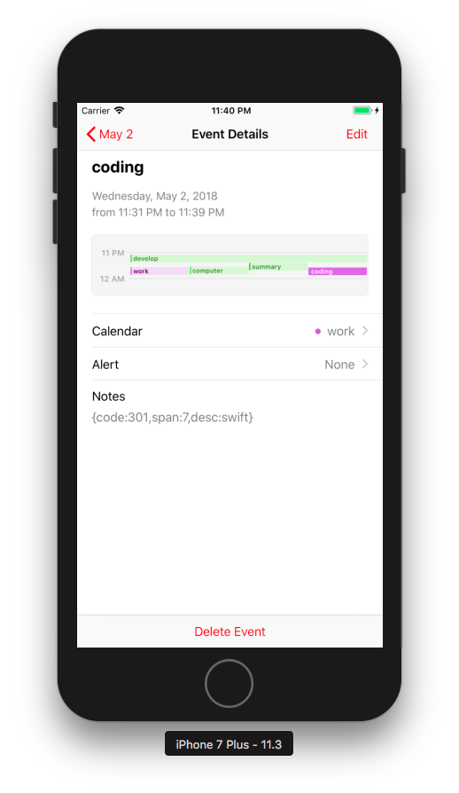

> The EventKit framework helps you access users’ Calendar and Reminders information.First of all I just want to push doneItems to apple Calendars.

### 1.EventKit architecture

Apple’s Event Kit framework allows you to access and manipulate calendars, events, and reminders.



### 2.Edit info.plist of project add Description for calendars
NSCalendarsUsageDescription 【访问日历】  

```swift
   func checkAuth()->Bool{
        let eventStore = EKEventStore()
        switch EKEventStore.authorizationStatus(for: .event) {
        case .authorized:
            return true
        case .denied:
            print("Access denied")
            return false
        case .notDetermined:
            eventStore.requestAccess(to: .event, completion: { (granted: Bool, NSError) -> Void in
                if granted {
                    print("Access Ok")
                }else{
                    print("Access denied")
                }
            })
        default:
            return false
        }
        return true
    }

```

### 3.Create Events by EKEvent class

Create a new event with the init(eventStore:) method of the EKEvent class.

You can edit the details of a new event or an event you previously fetched from the Calendar database by setting the event’s corresponding properties. Some of the details you can edit include:

- The event’s title with the title property.  
- The event’s start and end dates with the startDate and endDate properties.  
- The calendar with which the event is associated with the calendar property.  

```swift
        let doneEvent = EKEvent(eventStore: eventStore)
        doneEvent.calendar = calendarForEvent
        doneEvent.title = title
        doneEvent.startDate = Date(timeIntervalSince1970: Double(start))
        doneEvent.endDate   = Date()
        var notes = "{code:\(item.code),span:\(Int(Double(span)/60.0))"
        if desc != "" {
            notes += ",desc:\(desc)"
        }
        if spnd > 0 {
            notes += ",spnd:\(spnd)"
        }
        doneEvent.notes = notes + "}"
        do{
            try eventStore.save(doneEvent, span: .thisEvent, commit: true)
            print("saved event id = \(doneEvent.eventIdentifier)")
        }catch{
            uiLogError(msg: "add Event to calendar failed!")
        }
```

### 4.create calendar for work


### 5.github address
[timepie](https://github.com/bblu/timepie)