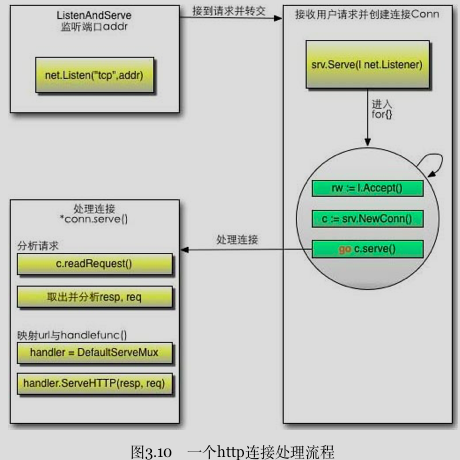

> <<Go Web编程-谢孟军>> golang 的标准库 net/http 提供了 http 编程接口封装了内部细节 http.request 和 http.ResponseWriter 两个对象交互就行。
之所以把http和database放一起是因为他们的实现机制有相似到地方。每个连接请求都会起一个goroutine去服务。


## HTTP 对象
- ResponseWriter： 生成Response的接口
- Handler： 处理请求和生成返回的接口
- ServeMux： 路由，后面会说到ServeMux也是一种Handler
- Conn : 用户的网络请求连接



- ListenAndServe 底层初始化server对象，调用net.Listen("tcp", addr)
- 监听端口之后调用srv.Serve(net.Listener)这个函数接收客户端请求
- 创建一个Conn单独开了一个goroutine，高并发到核心是 go c.serve()
- conn会解析request: c.readRequest()获取对应到Handler就是下面代码里到mux（原书给的是nil用DefaultServeMux）

>goroutine这个词让我想到了lua的Coroutine,简单说协程是轻量级的线程。编译和连接后的代码生成的可执行程序被操作系统执行起来就是进程，进程就是活的程序，一个进程里至少有一个线程叫主线程，主线程一般是界面线程，还会有一些后台数据访问和控制的线程，不同线程对竞争资源的访问会构成并发（concurrent）的请求，一般的解决方案是当前访问者把资源锁起来给自己用用完释放给别的线程。IMO. goroutine可以当成底层依靠线程池实现的超轻量的语言级的线程。
The Go FAQ section Why goroutines instead of threads? 

explains:  
Goroutines are part of making concurrency easy to use. The idea, which has been around for a while, is to multiplex independently executing functions—coroutines—onto a set of threads. When a coroutine blocks, such as by calling a blocking system call, the run-time automatically moves other coroutines on the same operating system thread to a different, runnable thread so they won't be blocked. The programmer sees none of this, which is the point. The result, which we call goroutines, can be very cheap: unless they spend a lot of time in long-running system calls, they cost little more than the memory for the stack, which is just a few kilobytes.

To make the stacks small, Go's run-time uses segmented stacks. A newly minted goroutine is given a few kilobytes, which is almost always enough. When it isn't, the run-time allocates (and frees) extension segments automatically. The overhead averages about three cheap instructions per function call. It is practical to create hundreds of thousands of goroutines in the same address space. If goroutines were just threads, system resources would run out at a much smaller number.

```go
package main

import (
	"fmt"
	"net/http"
	"log"
	"io"
)

func sayHello(res http.ResponseWriter, req *http.Request){
	req.ParseForm()
	fmt.Println(req.Form)
	fmt.Println("path", req.URL.Path)
	fmt.Println("scheme", req.URL.Scheme)
	fmt.Println(req.Form["url_long"])
	for k, v := range req.Form{
		fmt.Println("kv={",k,":",v,"}")
	}
	fmt.Fprintf(res, "hello world!")
}
func muxHello(res http.ResponseWriter, req *http.Request){
	fmt.Fprintf(res, "hello world!")
}
func muxEcho(w http.ResponseWriter, r *http.Request) {
	io.WriteString(w, r.URL.Path + " from serveMux")
}
//if you visit / you will get '404 page not found' error
func main() {
	http.HandleFunc("/", sayHello)
	mux := http.NewServeMux()
	mux.HandleFunc("/echo", muxEcho)
	mux.HandleFunc("/hello", muxHello)

	err := http.ListenAndServe(":8088",mux)
	if err != nil{
		log.Fatal("ListenAndServe: ", err)
    }
    //并不会打印出来
	log.Print("serve listen :8088")

}
```


> 谁知道为啥 select ‘2’+2 = 4 ？？？

## database/sql 接口

```go
//注册驱动到方法
//sql.Register(name string, driver driver.Driver)
//driver.Driver是一个数据库驱动接口，Open后返回一个Conn接口，返回的Conn只能用来进行一次goroutine操作。
func init(){
    sql.Register("sqlite3", &SQLiteDriver{})
}
//用过sqlite的应该对stmt很熟悉了
type Conn interface{
    Prepare(query string)(Stmt, error)
    Close() error
    Begin() (Tx, error)
}

```