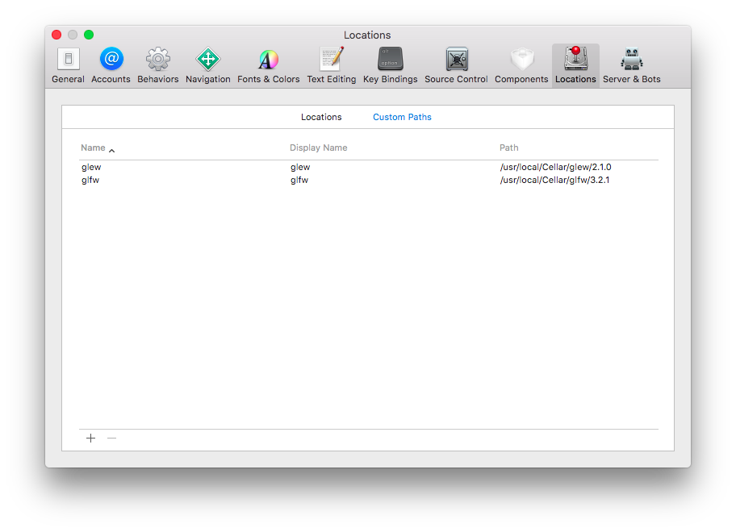
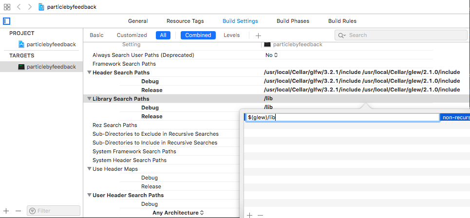
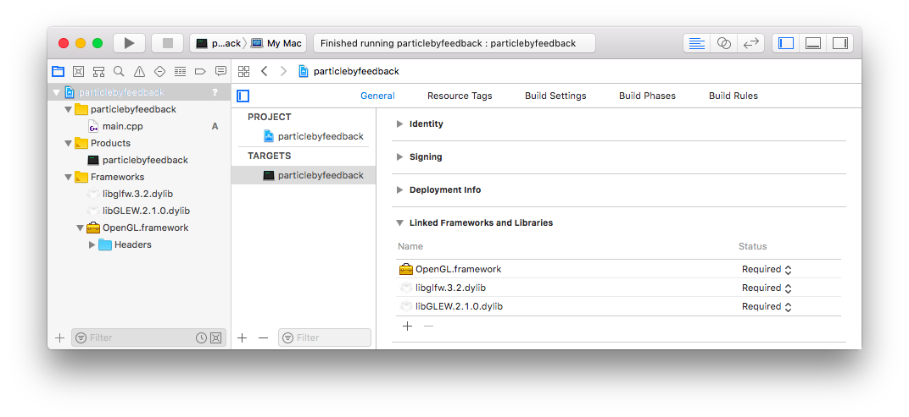
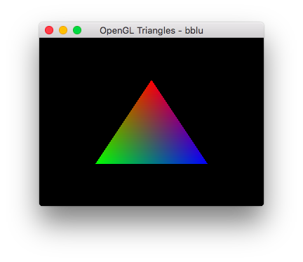

### 1. HomeBrew 安装依赖库：

```sh
#因为 OpenGL 没有窗口管理的功能，安装 glew 用来管理窗口，读取输入，处理事件等
macbook:profile bblu$ brew install glew
==> Downloading https://homebrew.bintray.com/bottles/glew-2.1.0.high_sierra.bott
######################################################################## 100.0%
==> Pouring glew-2.1.0.high_sierra.bottle.tar.gz
🍺  /usr/local/Cellar/glew/2.1.0: 38 files, 3MB

#GLEW 是一个跨平台的 C++ 扩展库，同样基于 OpenGL 图形接口。
macbook:profile bblu$ brew install glfw3
==> Downloading https://homebrew.bintray.com/bottles/glfw-3.2.1.high_sierra.bott
######################################################################## 100.0%
==> Pouring glfw-3.2.1.high_sierra.bottle.tar.gz
🍺  /usr/local/Cellar/glfw/3.2.1: 14 files, 286.3KB
```

## 2.xcode 加载配置

### 2.1.Locations

add 2 items to custom Path of Preference/Locations

    glew : /usr/local/Cellar/glew/2.1.0
    glfw : /usr/local/Cellar/glfw/3.2.1



### 2.2.serach paths
add 3rd part lib forder to Project's Header/Library Search Paths in build Settings.  
In order to find the item quickly you can search "search" word on the top-left window.  
in particular the way to add multi paths is duble-click the targat item,it take me a real time to make it.



### 2.3.library
Choose frameworks and libraries to add,select [add other] and then press shift+command+G to find libraries in /usr/local/Cellar/gl*w/xxx/lib.



## 3.新建一个cmd工程

* 在Xcode的启动面板中，选Create a new Xcode project.
* 在弹出的New Project窗口中，在左边选择Application/Command Line Tool。
* 选好保存项目的位置，并在Save As中输入项目名称比如particle。
* 将main.c的内容改为如下内容：

```cpp
#include <iostream>
#include <GL/glew.h>
#include <GLFW/glfw3.h>

void display(void)
{
    glClearColor(0.0f, 0.0f, 0.0f, 1.0f);
    glClear(GL_COLOR_BUFFER_BIT);
    glBegin(GL_TRIANGLES);
    {
        glColor3f(1.0,0.0,0.0);
        glVertex2f(0, .5);
        glColor3f(0.0,1.0,0.0);
        glVertex2f(-.5,-.5);
        glColor3f(0.0, 0.0, 1.0);
        glVertex2f(.5, -.5);
    }
    glEnd();
}

int main(int argc, const char * argv[]) {
    if(!glfwInit()){
        return -1;
    }
    GLFWwindow* win = glfwCreateWindow(640, 480, "OpenGL Triangles", NULL, NULL);
    if(!glewInit()){
        return -1;
    }
    glfwMakeContextCurrent(win);
    while(!glfwWindowShouldClose(win)){
        display();
        glfwSwapBuffers(win);
        glfwPollEvents();
    }
    glfwTerminate();
    return 0;
}
```

### what u see it a triangle

