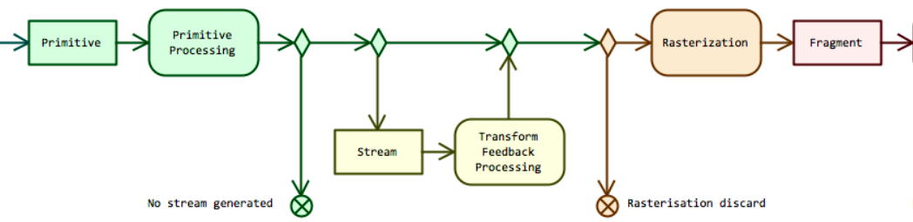

What ? Where ? Why ? and how?

### 1.what's [Transform Feedback](https://www.khronos.org/opengl/wiki/Transform_Feedback)

Transform Feedback is the process of **capturing Primitives generated by the Vertex Processing steps, recording data from those primitives into Buffer Objects**. 

Transform Feedback要干的事就是重新捕获即将装配成图元（primitives）的顶点然后将他们全部或部分属性传递给缓存对象。其实从名字上看就知道这个东西把顶点着色器产生的世界空间的几何体捕获transform之后重新扔进缓存进行后续的Rasterization处理。

话说DirectX跟OpenGL借鉴了很多东西，这个TF是OpenGL跟DirectX10的Stream Output学来的，那个东西就是实现粒子系统的杀手锏。

### 2.where's [Transform Feedback](http://www.seas.upenn.edu/~pcozzi/OpenGLInsights/OpenGL44PipelineMap.pdf)

这个东西正好在整个Pipeline的中间，往细了说略微偏上。

### 3.why we need TF

This allows one to preserve the post-transform rendering state of an object and resubmit this data multiple times.

OpenGLWiki上最关键的是这句，拿到变换后的顶点数据多次提交。说这个技术是给粒子系统定制的也不觉得过分。

### 4.how can we use TF

#### 4.1 begin/end the TF

    //绘制命令里的图元类型要和参数相符
    void glBeginTransformFeedback(GLenum primitiveMode);
    void glPauseTransformFeedback();
    void glResumeTransformFeedback();
    void EndTransformFeedback();