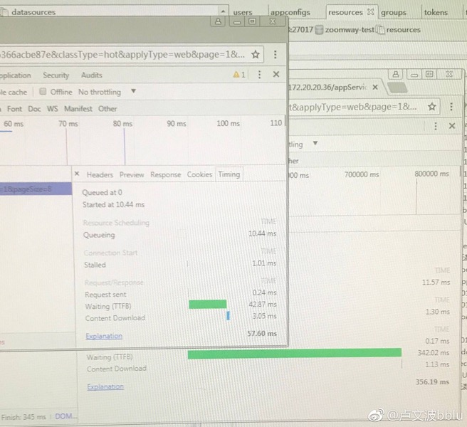

The structure of rest-full api is good with business logic, do not design it to sql-like or nosql-like style. (eg:/user?filter='age>10',is really not good for web developers to use)，Before making it right or efficient, keep it as simple as possible or even stupid. 

## 1.REST-full Api designing

### 1.1.simple api has no pitfalls

they're clear as what they look down below.

```js
//get all users
app.get('/user', handler);

//get a user(id=101)
app.get('/user/101', handler);

//get telephone number of the 101 user
app.get('/user/101/tel', handler);
```

### 1.2.page query

```js
reqUrl = '/user?page=1&limit=20'
```

### 1.3.range query
```js
//get users where age >18 and age <=38
//this can make the point but the meaning of url is get age not the user.
reqUrl = '/user?field=age&min=18&max=38'
//
reqUrl = '/user?age=(18,38]'
//get user dept in (100,200)
reqUrl = '/user?dept={100,200}'
```

### 1.4.modules with connection

```js
//get all users in dept 100
reqUrl = '/user?dept=100'
//get user from /user is better than /dept
reqUrl = '/dept/100/users'

//get all todos for user 101
reqUrl = '/todo?assignTo=101'
// is better than get them form /user
reqUrl = '/user/101/todo'
```

### 1.5.global search

```js
//e:endWith, s:startWith,
reqUrl = '/search/user?name=sabc&age=[18,]' 

reqUrl = '/search/poi?lng=124.38697&lat=41.56321&limit=10' 
```

## 2.一些工作感想

* 对于软件工程来说好的开始就是成功的一半和行百里者半九十是相辅相成的。一个新团队项目第一个模块写的好坏注定了这个项目的结局和项目团队的加班情况，如果测试不完整产品永远是半成品，这里的完整不是指覆盖率，我喜欢针对性的开发和测试，熟悉业务排除掉不存在的情况和陷阱，甚至只抛出异常输出一个提升不作处理如果出现了再完善。

* 服务接口的重用不一定是直接拆开比如a，b两个过程得到结果，如果a也有业务需求，那么不是拆成a服务和b服务，而是a服务和ab服务，当然还可以不拆分就用同一个服务或者同一个实现通过参数区分。

* 关于参数的问题，参数要直接不要做任何封装。不管是入参还是返回值都要直接给，拖泥带水的后果就是在内部加一堆判断或者调用你的接口后再取一次值都是无效操作。

```js
    //取参数的工作交给上层，上层知道那个具体情况，
    //如果是id直接传ID，否则调用者自己去取user.id传下来，
    //即节省了代码量又提高了执行效率。
    function getUser(param){
        if(typeof param ==='string'){
            //。。。
        }
        else if(param && param.uid){ 
            //。。。
        }
    }
```

* 白天和同事讨论待办项和关联业务的接口涉及二者的关系，他的观点是待办项包含业务是强关系。首先这两个模块只有一个接口调用用业务id查显示的图标id，如果两个模块强关系不能就只调一个接口。其次即是查不到图标也就显示不出来，并不影响待办业务接下来的处理流程。强包含关系是组合。好比放风筝的人包含手和脚是强关系【组合】，人和风筝虽然有一根线的联系但绳子断了不影响人的生存，人和风筝就是有【关联】而已是弱关系。

* 第二个讨论问题就是待办项里业务ID记录每个待办项属于那个业务的，查业务ID获得图标id的操作是推给前端还是放到服务下层？前端不愿意多调一次服务就一个理由效率高。可是问题有:
1.为了一个接口引用了一个库，
2.模块耦合放大了修改维护的范围
3.部署服务的时候耦合的模块必须一同发布。
4.业务和待办项是1:n关系，服务去做需要[嵌套]for循环，前端本来就输出循环可以直接用。
5.即使服务做了给前端图标id，前端还是调用资源服务一个一个的把图标取回来显示！个位数的业务种类全部取了缓存一下不.就.不.用.查.了.吗？

* 程序员命名标识符的时候光查字典是不够的，作为基本的素养还要能区分常用词和生僻词，就一个检查任务的接口能查出audit和check，然后直接就把排前面的写上了。这就像你不说某人有病，而说某人贵恙。怎么看怎么别扭啊。

* 不要对不要过早地优化有什么误解。每当听到用这句话给烂代码辩解我就很崩溃！代码分好代码烂代码和恶心的代码，好代码就不说了，烂代码至少在烂的道路上还是有章可循的烂的有一致性不影响你写不烂的代码，但是恶心的代码是烂的各具特色只要你用就最好的情况是写烂代码，因为不一致和各自实现的问题你不copy代码就要加一堆判断。真是应了那句老话漂亮的代码都是相似的恶心的代码各有各的恶心。

* 给业务层使用的数据访问层就应该是定制的接口，访问层的接口要能体现简单业务逻辑而不是暴露查询的实现细节，细节在访问实现层下面实现。比如访问层getUserById(uid),下面的实现层选择去做select * from user where id=uid，或者user.find({id:uid})，再比如空间查询应该getDeviceByRegion(region),空间查询的实现方式应该封装到实现层，而不是业务实现的人去学习wkt串拼sql或者nosql的空间find对象怎么组装。 如果你封装了三四层最后还是要业务开发人员了解具体数据库实现细节那么这个封装就是失败的。接口要简单正确高效，每一层都要把自己这层的事干好不要偷懒扔给上一层。

## 3.服务优化的成果
优化数据库结构和代码重构后查询服务的时间消耗是重构前服务的一个零头（旧服务是342ms，新服务是42毫秒，另外可以参考一下老服务验证token的时间是55ms）。主要是数据库的调整因为写数据库的频率很低，把直接写关联读变成关联写直接读，代码的优化主要是抽象和重用，原来6个查询服务是六个处理函数但是每个函数里边60%以上是重复代码，合并成两个一个单个查询和一个批量查询。

