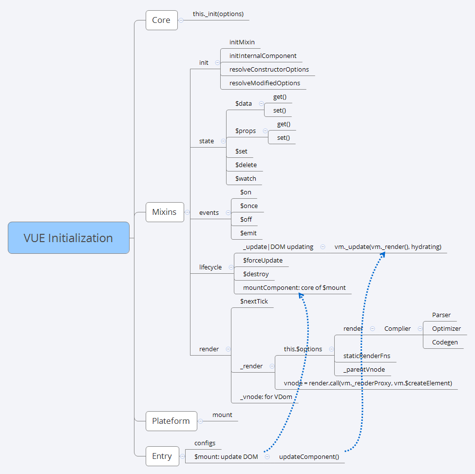
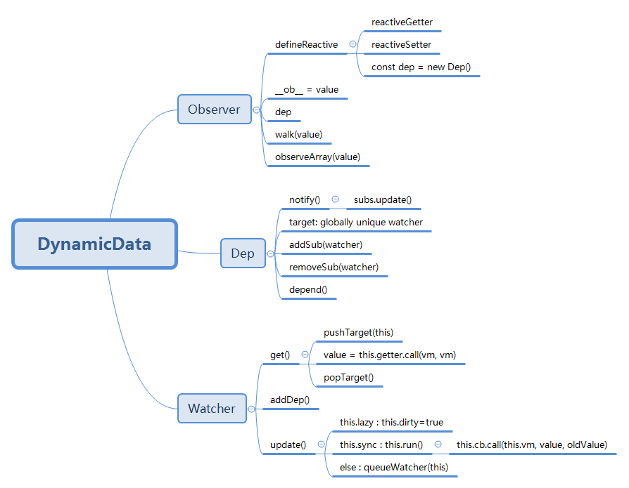

### inside code for vue initialization



### inside code for dynamic data binding




### code sample form vue.org

#### simple vue instances
```html
<html>
<script src="https://cdn.jsdelivr.net/npm/vue"></script>
<body>
<div id="app">
  message:{{ msg }}
</div>
<br/>
<div id="app-1">
  <span v-bind:title="message">
    1：鼠标悬停几秒钟查看此处动态绑定的提示信息！
  </span>
</div>

<div id="app-2">
  <p v-if="seen">2：现在你看到我了</p>
  <p v-else>2:</p>
  in another way...
  <p v-if="Math.random() > 0.5">Now you see me</p>
  <p v-else>Now you don't</p>
</div>

<div id="app-3">
  <p>3：v-for="todo in todos" 循环</p>
  <ol>
    <li v-for="todo in todos">
      {{ todo.text }}
    </li>
  </ol>
</div>

<div id="app-4">
  <button v-on:click="reverseMessage">4：逆转消息</button>
  <div>{{ message }}</div>
</div>

<div id="app-5">
  <p>{{ message }}</p>
  <input v-model="message">
</div>

</body>

<script>
var app = new Vue({
  el: '#app',
  data: {
    msg: '0: Hello Vue!'
  }
})

var app1 = new Vue({
  el: '#app-1',
  data: {
    message: '页面加载于 ' + new Date().toLocaleString()
  }
})
//在控制台输入 app3.seen = false 之前显示的消息消失了
var app2 = new Vue({
  el: '#app-2',
  data: {
    seen: true
  }
})
//在控制台里，输入 app4.todos.push({ text: '新项目' })，
//你会发现列表最后添加了一个新项目。
var app3 = new Vue({
  el: '#app-3',
  data: {
    todos: [
      { text: 'JS' },
      { text: 'Vue' },
      { text: 'Project' }
    ]
  }
})
var app4 = new Vue({
  el: '#app-4',
  data: {
    message: 'VUE'
  },
  methods: {
    reverseMessage: function () {
      this.message = this.message.split('').reverse().join('')
    }
  }
})

var app5 = new Vue({
  el: '#app-5',
  data: {
    message: '5:Hello Vue!'
  }
})
</script>

</html>
```

#### simple vue template
```html
<html>

<script src="https://cdn.jsdelivr.net/npm/vue"></script>

<body>
<div id="app">
  <p>message: {{ msg }}</p>
  <span v-once>This will never change: {{ msg }}</span>
  
  <p>computed property: {{ reversedMessage }}</p>
  <p>reverse methods(): {{ reverseMethod() }}</p>
  
  <p><b># Raw HTML</b></p>
  <p>Using only mustaches: {{ rawHtml }}</p>
  <p>Using v-html directive: <span v-html="rawHtml"></span></p>

  <p><b># Attributes</b></p>
  <div v-bind:id="'btn-' + dynamicId">id: btn-{{ dynamicId }}</div>
  <button v-bind:disabled="isButtonDisabled">ButtonDisabled:{{isButtonDisabled}}</button>
  
  <p><b># Arguments</b></p>
  <a v-bind:href="url"> Link... </a><br/>
  <button v-on:click="reverseMessage">reverseMessage {{msg}}</button>
  
  <p><b># Shorthand</b></p>
  <!-- full syntax -->
  <a v-bind:href="url"> full syntax... </a>
  <!-- shorthand -->
  <a :href="url"> shorthand... </a><br/>
  <button @click="reverseMessage">shortHand {{msg}}</button>
  
  <p><b># Computed vs Watched Property</b></p>
  <input v-model="firstName">watch Name</input>
  <input v-model="fullName"/><br>
  <input v-model="firstName1">computed Name1</input>
  <input v-model="fullName1"/>
  
</div>
</body>

<script>
var app = new Vue({
  el: '#app',
  data: {
    msg: 'Hello Vue!',
	rawHtml:'<span style="color: red">red</span>',
	dynamicId:'1215',
	isButtonDisabled:false,
	url:'https://bblu.github.com',
	firstName:'Lu',
	lastName:'bb',
	fullName:'bb Lu',
	firstName1:'Lu',
	lastName1:'bb',
  },
  computed: {
    // a computed getter
    reversedMessage: function () {
      // `this` points to the vm instance
      return this.msg.split('').reverse().join('')
    },
	fullName1: function(){
	return this.firstName1 + ' ' + this.lastName1
	}
  },
  methods: {
    reverseMessage: function () {
      this.msg = this.msg.split('').reverse().join('')
    },
	reverseMethod: function () {
    return this.msg.split('').reverse().join('')
    }
  },
  watch:{
  firstName: function(val){this.fullName = val + ' ' + this.lastName},
  lastName: function(val){this.fullName = this.firstName + ' ' + val }
  }
})
</script>

</html>
```

#### 
```html
<html>

<script src="https://cdn.jsdelivr.net/npm/vue"></script>

<body>
<div id="app">
  {{ msg }}
</div>
<br/>
<div id="components-demo">
  <button-counter></button-counter>
</div>

<div id="blog-post-demo">
 <h2>Passing Data to Child Components with Props</h2>
	<blog-post title="My journey with Vue"></blog-post>
	<blog-post title="Blogging with Vue"></blog-post>
	<blog-post title="Why Vue is so fun"></blog-post>

<br>in another way...</br>

<blog-post
  v-for="post in posts"
  v-bind:key="post.id"
  v-bind:title="post.title"
></blog-post>

</div>

<div id="alert-box-demo">
<alert-box>
  Something bad happened.
</alert-box>
</div>

#Dynamic Components
<component v-bind:is="currentTabComponent"></component>

</body>

<script>
// Define a new component called button-counter
Vue.component('button-counter', {
  data: function () {
    return {
      count: 0
    }
  },
  template: '<button v-on:click="count++">You clicked me {{ count }} times.</button>'
})
new Vue({ el: '#components-demo' })

Vue.component('blog-post', {
  props: ['title'],
  template: '<h3>{{ title }}</h3>'
})
new Vue({
  el: '#blog-post-demo',
  data: {
    posts: [
      { id: 1, title: 'My journey with Vue' },
      { id: 2, title: 'Blogging with Vue' },
      { id: 3, title: 'Why Vue is so fun' }
    ]
  }
})


Vue.component('alert-box', {
  template: `
    <div class='demo-alert-box'>
      <strong>Error!</strong>
      <slot></slot>
    </div>
  `
})
new Vue({ el: '#alert-box-demo' })

var app = new Vue({
  el: '#app',
  data: {
    msg: 'components-demo'
  }
})

</script>

</html>
```