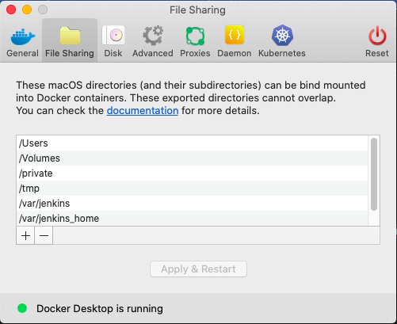

想要使用 Docker 来搭建 GitLab 的话需要先安装 Docker, 官方的说法Desktop版本是最方便的部署方式，安装非常简单就官网下载即可，另外可以设置一下免sudo使用docker也挺方便的。

### pull GitLab CE image

```bash
$ docker pull gitlab/gitlab-ce
```

> 如果需要下载其他版本如： $ sudo docker pull gitlab/gitlab-ce:rc

### Run GitLab Instance

运行之前先在Desktop里边添加一个本机路径



```bash
docker run --detach \
  --hostname gitlab.bblu.com \
  --publish 8080:80 --publish 2022:22 \
  --name gitlab \
  --restart always \
  --volume /var/gitlab/config:/etc/gitlab \
  --volume /var/gitlab/logs:/var/log/gitlab \
  --volume /var/gitlab/data:/var/opt/gitlab \
  gitlab/gitlab-ce:latest
```

### Add user private_token

- 给User 添加Access_token

### Add Users by API

```bash
#!/bin/bash
cmp="@sample.com"
while read line
do
    name=`echo $line | awk '{print $1}'`
    username=`echo $line | awk '{print $2}'`
    mail=$username$company
    echo $mail
    curl -d "projects_limit=0&can_create_group=false&password=User@1234&email=$mail&username=$username&name=$name&private_token=i15ZspAj_sVkTxvTUqKG" "http://172.16.19.175:8080/api/v3/users"
done < ./user

# user file
张三 zhangsan
李四 lisi

# API V3 ERRIR
{"error":"API V3 is no longer supported. Use API V4 instead."}

# change V3->V4 and get success message
{"id":2,"name":"bblu","username":"bblu","state":"active","avatar_url":"https://www.gravatar.com/avatar/b2c9e8966d55f7729cec433494bd6f3c?s=80\u0026d=identicon","web_url":"http://gitlab.dingxin.com/bblu","created_at":"2019-10-24T07:10:14.657Z","bio":null,"location":null,"public_email":"","skype":"","linkedin":"","twitter":"","website_url":"","organization":null,"last_sign_in_at":null,"confirmed_at":null,"last_activity_on":null,"email":"bblu@china.com","theme_id":1,"color_scheme_id":1,"projects_limit":0,"current_sign_in_at":null,"identities":[],"can_create_group":false,"can_create_project":false,"two_factor_enabled":false,"external":false,"private_profile":false,"is_admin":false}
```
